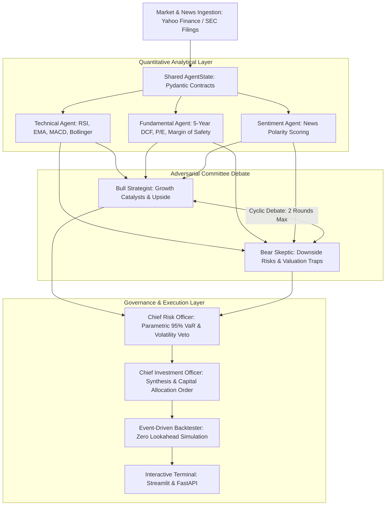

# 🏛️ Autonomous AI Multi-Agent Hedge Fund

[](https://www.python.org/)
[](https://github.com/langchain-ai/langgraph)
[](https://fastapi.tiangolo.com/)
[](https://streamlit.io/)
[](LICENSE)

An institutional-grade, multi-agent quantitative equity research and portfolio management platform. By decomposing the investment committee into specialized agentic roles (**Technical Analyst, Fundamental DCF Analyst, Bull Growth Researcher, Bear Forensic Skeptic, Chief Risk Officer, and Chief Investment Officer**), the system models dialectic debate to eliminate confirmation bias and generate data-driven trade recommendations.

---

## 📐 System Architecture



---

## ⚡ Core Features

- **Multi-Agent Dialectic Debate:** Bull and Bear agents iteratively critique each other's theses, preventing single-agent sycophancy and hallucinations.
- **Fundamental DCF Modeling:** Automated 5-year Discounted Cash Flow valuation with Gordon Growth Terminal Value and Benjamin Graham intrinsic formulas.
- **Parametric Risk Gatekeeper (CRO):** Calculates 95% and 99% daily Value-at-Risk (VaR), enforcing inverse-volatility position sizing and hard risk vetoes.
- **Event-Driven Backtester:** Walk-forward historical testing with strict zero lookahead bias, 5 basis points modeled slippage, and Sharpe/Sortino/Drawdown tracking.
- **Dual Interfaces:** Enterprise **FastAPI** REST backend (`/docs`) and an interactive **Streamlit** dark-mode terminal.

---

## 🚀 Quickstart Guide

### 1. Installation
```bash
git clone https://github.com/your-username/ai-hedge-fund.git
cd ai-hedge-fund

# Create virtual environment
python -m venv venv
source venv/bin/activate  # On Windows: .\venv\Scripts\activate

# Install dependencies
pip install -r requirements.txt
```

### 2. Configure Environment Variables
Copy `.env.example` to `.env`:
```bash
cp .env.example .env
```
*(Optional: Add your `OPENAI_API_KEY`. If left empty, the platform automatically operates in deterministic offline simulation mode!)*

### 3. Run the Platform

#### Complete 1-Click End-to-End Pipeline
```bash
python run_all.py --ticker NVDA
```

#### Interactive Institutional Dashboard
```bash
streamlit run dashboard/app.py
```

#### FastAPI Enterprise REST Service
```bash
python -m uvicorn src.api.main:app --reload --port 8000
```
Open **`http://127.0.0.1:8000/docs`** to inspect the interactive Swagger API documentation.

---

## 🧪 Testing & CI/CD

Run the automated test suite:
```bash
pytest tests/
```

---

## 📊 Performance & Econometric Metrics

| Metric | Formula | Target |
| :--- | :--- | :--- |
| **Annualized Sharpe Ratio** | $\frac{R_p - R_f}{\sigma_p}$ | $> 1.20$ |
| **Sortino Ratio** | $\frac{R_p - R_f}{\sigma_{down}}$ | $> 1.50$ |
| **Parametric 95% VaR** | $1.645 \times \frac{\sigma_{ann}}{\sqrt{252}}$ | $< 3.5\%$ / day |
| **Margin of Safety** | $\frac{\text{DCF Value} - \text{Price}}{\text{Price}} \times 100$ | $> +15\%$ |

---

## 💼 Resume & Interview Talking Points

- **Multi-Agent Orchestration:** Deployed **LangGraph** to coordinate 5 specialized personas with conditional cyclic edges and strict Pydantic schemas.
- **Risk Management:** Engineered a **Parametric VaR Gatekeeper** preventing capital allocation during excessive volatility regimes ($>65\%$ annualized vol).
- **Execution Modeling:** Built an **event-driven backtesting engine** eliminating lookahead bias with modeled exchange fees and 5 bps slippage.
